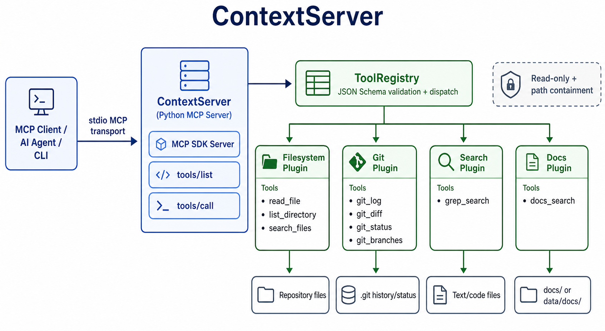

# ContextServer

ContextServer is a local Python MCP server for repository inspection. It gives MCP-compatible AI clients a small, read-only toolset for reading files, listing directories, searching text, searching documentation, and inspecting Git state inside a configured repository root.

It is best described as:

```text
Python backend process
-> MCP tool server
-> read-only repository context provider for AI agents
```

It is not a REST API, browser extension, hosted SaaS backend, or plugin marketplace package. MCP clients communicate with it through the Model Context Protocol over stdio. In practice, an MCP client starts ContextServer as a subprocess and sends `tools/list` and `tools/call` requests over standard input/output. The project also includes a local browser dashboard for manually managing stdio MCP server definitions and calling their tools.

## Current Status

Implemented:

- MCP stdio server using the official `mcp` Python SDK
- Tool discovery through `tools/list`
- Tool invocation through `tools/call`
- JSON Schema validation for tool parameters
- 9 read-only tools:
  - `read_file`
  - `list_directory`
  - `search_files`
  - `git_log`
  - `git_diff`
  - `git_status`
  - `git_branches`
  - `grep_search`
  - `docs_search`
- Internal plugin-style tool registration for filesystem, Git, search, and documentation tool groups
- Interactive CLI client for manually testing tools
- Local web dashboard for listing/calling tools and adding other stdio MCP servers
- Path containment checks for filesystem access
- Test suite covering path safety, filesystem tools, Git tools, search tools, documentation search, plugin registration, MCP stdio integration, web UI helpers, registry behavior, and CLI argument parsing

Current scope:

- Local stdio MCP server, designed to be launched by an MCP-compatible client.
- Read-only repository inspection, not file editing or code modification.
- Literal search and documentation search, not embedding-based semantic retrieval.
- Developer-focused CLI and local browser dashboard for manual testing, not a hosted service.

The CLI accepts `--transport stdio` because stdio is the supported transport for this local MCP server.

## Architecture Overview



```text
MCP Client / Interactive CLI
        |
        | stdio transport
        v
ContextServer
        |
        v
ToolRegistry
        |
        +-- Filesystem tools
        |   +-- read_file
        |   +-- list_directory
        |   +-- search_files
        |
        +-- Git tools
        |   +-- git_log
        |   +-- git_diff
        |   +-- git_status
        |   +-- git_branches
        |
        +-- Search tools
        |   +-- grep_search
        |
        +-- Documentation tools
            +-- docs_search
```

The server process is configured with one repository root. All filesystem paths are resolved relative to that root and validated before file I/O. Git commands run with the repository root as the subprocess working directory. Built-in tools are grouped into internal plugin modules, so new tool groups can be registered without changing MCP request routing.

## Repository Layout

```text
ContextServer/
├── client/
│   ├── __init__.py
│   └── cli.py
├── data/
│   └── docs/
│       ├── .gitkeep
│       └── contextserver.md
├── server/
│   ├── __init__.py
│   ├── main.py
│   ├── mcp_server.py
│   ├── path_utils.py
│   ├── tool_registry.py
│   └── web_ui.py
├── tests/
│   ├── __init__.py
│   ├── test_docs_tools.py
│   ├── test_filesystem_tools.py
│   ├── test_git_tools.py
│   ├── test_main.py
│   ├── test_mcp_stdio_integration.py
│   ├── test_path_utils.py
│   ├── test_search_tools.py
│   ├── test_tool_plugins.py
│   ├── test_tool_registry.py
│   └── test_web_ui.py
├── tool_plugins/
│   ├── __init__.py
│   ├── docs.py
│   ├── filesystem.py
│   ├── git.py
│   └── search.py
├── tools/
│   ├── __init__.py
│   ├── docs_tools.py
│   ├── filesystem_tools.py
│   ├── git_tools.py
│   └── search_tools.py
├── assets/
│   └── contextserver-architecture.png
├── .gitignore
├── LICENSE
├── README.md
└── pyproject.toml
```

### Key Files

| File | Purpose |
| --- | --- |
| `server/main.py` | CLI entry point. Parses arguments, validates the repository root, registers tools, and starts the MCP server. |
| `server/mcp_server.py` | Wraps the MCP SDK low-level server and exposes `tools/list` and `tools/call`. |
| `server/tool_registry.py` | Stores tool definitions, returns tool manifests, validates parameters, and dispatches calls. |
| `server/path_utils.py` | Resolves paths and enforces containment inside the configured repository root. |
| `server/web_ui.py` | Local browser dashboard for managing stdio MCP server definitions and calling tools. |
| `tool_plugins/` | Internal plugin-style registration modules for built-in tool groups. |
| `tools/docs_tools.py` | Implements `docs_search`. |
| `tools/filesystem_tools.py` | Implements `read_file`, `list_directory`, and `search_files`. |
| `tools/git_tools.py` | Implements `git_log`, `git_diff`, `git_status`, and `git_branches`. |
| `tools/search_tools.py` | Implements `grep_search`. |
| `client/cli.py` | Starts ContextServer over stdio and provides a small REPL for manual testing. |
| `tests/` | Automated test suite. |

## Requirements

- Python 3.10 or newer
- Git CLI on `PATH` for Git tools
- A Git repository if you want to use `git_*` tools

Runtime Python dependencies:

| Package | Purpose |
| --- | --- |
| `mcp` | MCP server/client SDK |
| `jsonschema` | Tool input validation |

Development dependencies:

| Package | Purpose |
| --- | --- |
| `pytest` | Test runner |
| `pytest-asyncio` | Async test support |
| `hypothesis` | Property-based testing support |

## Installation

From the repository root:

```bash
pip install -e .
```

For development:

```bash
pip install -e ".[dev]"
```

If your default Python is older than 3.10, create a compatible virtual environment first:

```bash
python3.10 -m venv .venv
source .venv/bin/activate
pip install -e ".[dev]"
```

## Running the Server

Serve the current directory:

```bash
python -m server.main
```

Serve a specific repository:

```bash
python -m server.main --repo-root /path/to/repo
```

Use the installed console script:

```bash
context-server --repo-root /path/to/repo
```

Explicitly specify stdio transport:

```bash
python -m server.main --repo-root /path/to/repo --transport stdio
```

Expected startup message:

```text
Starting ContextServer with transport: stdio
```

After startup, the process waits for MCP messages on stdio. Running it directly in a terminal is useful only as a startup smoke test. Press `Ctrl+C` to stop it.

## Running the Local Web UI

ContextServer includes a local browser dashboard for manually working with MCP servers. The dashboard can:

- Show the built-in ContextServer entry for the selected repository root.
- List tools from any configured stdio MCP server.
- Call tools with JSON arguments.
- Add and remove user-defined stdio MCP server definitions.

Start the dashboard:

```bash
python -m server.web_ui --repo-root /path/to/repo
```

Or use the installed console script:

```bash
context-server-ui --repo-root /path/to/repo
```

Expected startup output:

```text
ContextServer UI: http://127.0.0.1:8765
Repository root: /path/to/repo
MCP server config: /path/to/ContextServer/.contextserver/mcp_servers.json
```

Open the shown URL in a browser.

### Adding Other MCP Servers

The dashboard supports stdio MCP servers. To add one, provide:

| Field | Description |
| --- | --- |
| Name | Display name in the dashboard. |
| Command | Executable command, such as `python`, `node`, or an installed MCP server binary. |
| Args | Shell-style argument string, such as `-m package.server --flag value`. |
| Working directory | Optional process working directory. |

User-added server definitions are stored locally in `.contextserver/mcp_servers.json`, which is ignored by Git. Commands run on your machine, so only add MCP servers you trust.

## Using the Interactive CLI Client

The included client starts ContextServer as a subprocess over stdio and gives you a REPL for manual tool testing.

```bash
python -m client.cli --repo-root /path/to/repo
```

Example session:

```text
Connecting to ContextServer (repo: /path/to/repo) ...
Connected. Type 'help' for available commands.

mcp> list_tools
mcp> call read_file {"path": "README.md", "start_line": 1, "end_line": 5}
mcp> call list_directory {"path": ".", "depth": 1}
mcp> call search_files {"pattern": "**/*.py"}
mcp> call grep_search {"query": "ContextServer", "include_pattern": "*.md"}
mcp> call docs_search {"query": "ContextServer"}
mcp> call git_status {}
mcp> quit
Disconnected.
```

CLI commands:

| Command | Description |
| --- | --- |
| `list_tools` | List all tools exposed by the server. |
| `call <name> <json>` | Call a tool with JSON parameters. |
| `help` | Show REPL help. |
| `quit` / `exit` | Exit the REPL. |

## MCP Client Configuration

ContextServer can be configured in an MCP-compatible client by pointing the client at the Python module entry point.

Example `mcp.json`:

```json
{
  "mcpServers": {
    "ContextServer": {
      "command": "python",
      "args": [
        "-m",
        "server.main",
        "--repo-root",
        "/path/to/repo"
      ],
      "cwd": "/path/to/ContextServer"
    }
  }
}
```

If installed with `pip install -e .`, you can also use the console script:

```json
{
  "mcpServers": {
    "ContextServer": {
      "command": "context-server",
      "args": [
        "--repo-root",
        "/path/to/repo"
      ]
    }
  }
}
```

The exact config file location and schema depend on the MCP client you are using.

## Programmatic MCP Client Example

```python
import asyncio

from mcp.client.session import ClientSession
from mcp.client.stdio import StdioServerParameters, stdio_client


async def main() -> None:
    params = StdioServerParameters(
        command="python",
        args=[
            "-m",
            "server.main",
            "--repo-root",
            "/path/to/repo",
        ],
        cwd="/path/to/ContextServer",
    )

    async with stdio_client(params) as (read_stream, write_stream):
        async with ClientSession(read_stream, write_stream) as session:
            await session.initialize()

            tools = await session.list_tools()
            print([tool.name for tool in tools.tools])

            result = await session.call_tool(
                "read_file",
                {"path": "README.md", "start_line": 1, "end_line": 5},
            )
            print(result.content[0].text)


asyncio.run(main())
```

## Tool Reference

All tool parameters are JSON objects. Tool outputs are returned as MCP `TextContent`. String results are returned directly. Non-string results are JSON-serialized before being placed in `TextContent`.

Known tool errors are returned as MCP error responses with `isError: true`; they do not crash the server.

### `read_file`

Read UTF-8 text content from a file inside the configured repository root.

Parameters:

| Name | Type | Required | Description |
| --- | --- | --- | --- |
| `path` | string | Yes | File path relative to the repository root. Absolute paths are accepted only if they resolve inside the repository root. |
| `start_line` | integer | No | 1-indexed first line to include. |
| `end_line` | integer | No | 1-indexed final line to include, inclusive. |

Examples:

```json
{"path": "README.md"}
```

```json
{"path": "server/main.py", "start_line": 1, "end_line": 20}
```

Returns:

```text
file contents
```

Behavior:

- Reads the full file when no line range is supplied.
- Uses 1-indexed line numbers.
- Treats `end_line` as inclusive.
- Opens files as UTF-8 text.
- Raises `FileNotFoundError` if the resolved path is not a file.
- Raises `PathContainmentError` if the path resolves outside the repository root.

### `list_directory`

List files and directories inside a directory.

Parameters:

| Name | Type | Required | Description |
| --- | --- | --- | --- |
| `path` | string | Yes | Directory path relative to the repository root. |
| `depth` | integer | No | Recursion depth. Defaults to `1`. A depth of `1` returns immediate children only. |

Example:

```json
{"path": ".", "depth": 2}
```

Returns:

```json
[
  {"name": "README.md", "type": "file"},
  {"name": "server", "type": "directory"},
  {"name": "server/main.py", "type": "file"}
]
```

Behavior:

- Returns a flat list.
- Sorts child names before collecting entries.
- Uses `type` values of `file` or `directory`.
- Returns nested entry names relative to the requested directory.
- Silently skips unreadable subdirectories.
- Raises `FileNotFoundError` if the resolved path is not a directory.
- Raises `PathContainmentError` if the path resolves outside the repository root.

### `search_files`

Find files by glob pattern.

Parameters:

| Name | Type | Required | Description |
| --- | --- | --- | --- |
| `pattern` | string | Yes | Glob pattern such as `*.py`, `**/*.py`, or `*.json`. |
| `base_dir` | string | No | Subdirectory to search from. Defaults to the repository root. |

Examples:

```json
{"pattern": "**/*.py"}
```

```json
{"pattern": "*.json", "base_dir": "config"}
```

Returns:

```json
[
  "client/cli.py",
  "server/main.py",
  "tools/git_tools.py"
]
```

Behavior:

- Uses `pathlib.Path.glob`.
- Returns files only, not directories.
- Returns paths relative to the repository root.
- Sorts results before returning.
- Raises `PathContainmentError` if `base_dir` resolves outside the repository root.

### `git_log`

Return recent commits from the configured repository.

Parameters:

| Name | Type | Required | Description |
| --- | --- | --- | --- |
| `max_count` | integer | No | Maximum number of commits to return. Defaults to `10`. |
| `file_path` | string | No | Restrict history to commits that touched this file. |

Examples:

```json
{}
```

```json
{"max_count": 5}
```

```json
{"file_path": "README.md", "max_count": 3}
```

Returns:

```json
[
  {
    "hash": "360cb49...",
    "author": "Srujay Reddy",
    "date": "2026-06-01T12:00:00-07:00",
    "message": "Add ContextServer implementation"
  }
]
```

Behavior:

- Runs `git log`.
- Returns full commit hashes.
- Uses ISO author dates from Git.
- Returns an empty list for Git errors such as an empty repository.
- Raises `GitNotAvailableError` if `git` is missing or no `.git` directory exists at the configured repository root.

### `git_diff`

Return Git diff text.

Parameters:

| Name | Type | Required | Description |
| --- | --- | --- | --- |
| `ref1` | string | No | First Git reference. |
| `ref2` | string | No | Second Git reference. |

Examples:

```json
{}
```

```json
{"ref1": "HEAD~1"}
```

```json
{"ref1": "HEAD~1", "ref2": "HEAD"}
```

Behavior:

- With no refs, runs `git diff` and returns uncommitted working-tree changes.
- With `ref1`, returns the diff between `ref1` and the working tree.
- With `ref1` and `ref2`, returns the diff between those refs.
- Verifies supplied refs with `git rev-parse --verify`.
- Returns an empty string when there is no diff.
- Raises `GitRefNotFoundError` for invalid refs.
- Raises `GitNotAvailableError` if `git` is missing or no `.git` directory exists at the configured repository root.

### `git_status`

Return branch and file status.

Parameters:

```json
{}
```

Returns:

```json
{
  "branch": "main",
  "modified": ["README.md"],
  "staged": ["server/main.py"],
  "untracked": ["notes.txt"]
}
```

Behavior:

- Runs `git status --porcelain=v1 --branch`.
- Parses the current branch name.
- Separates modified, staged, and untracked paths.
- Handles renamed paths by reporting the new path.
- Raises `GitNotAvailableError` if `git` is missing, no `.git` directory exists, or `git status` fails.

### `git_branches`

Return local Git branches.

Parameters:

```json
{}
```

Returns:

```json
[
  {"name": "main", "is_current": true},
  {"name": "feature-x", "is_current": false}
]
```

Behavior:

- Runs `git branch --list`.
- Returns local branches only.
- Marks the checked-out branch with `is_current: true`.
- Skips detached HEAD entries.
- Raises `GitNotAvailableError` if `git` is missing, no `.git` directory exists, or `git branch` fails.

### `grep_search`

Search UTF-8 text files line by line for a literal query.

This is a plain full-text search tool. It does not perform semantic search, ranking, fuzzy matching, or documentation indexing.

Parameters:

| Name | Type | Required | Description |
| --- | --- | --- | --- |
| `query` | string | Yes | Literal text to search for. The query is escaped before regex compilation. |
| `include_pattern` | string | No | Glob-style filter matched against repository-relative paths. |
| `case_sensitive` | boolean | No | Whether matching is case-sensitive. Defaults to `true`. |

Examples:

```json
{"query": "TODO"}
```

```json
{"query": "def main", "include_pattern": "*.py"}
```

```json
{"query": "contextserver", "case_sensitive": false}
```

Returns:

```json
[
  {
    "file": "server/main.py",
    "line_number": 37,
    "content": "        description=\"ContextServer - MCP tool server for repository inspection\",",
    "context_before": [
      "def _parse_args(argv: list[str] | None = None) -> argparse.Namespace:",
      "    \"\"\"Parse command-line arguments.\"\"\""
    ],
    "context_after": [
      "    )",
      "    parser.add_argument("
    ]
  }
]
```

Behavior:

- Walks the configured repository root with `os.walk`.
- Reads candidate files as UTF-8 text.
- Skips binary, unreadable, or non-UTF-8 files.
- Returns every matching line.
- Includes up to 2 lines of context before and after each match.
- Uses literal matching by escaping the supplied query with `re.escape`.
- Uses `fnmatch.fnmatch` for `include_pattern`.

### `docs_search`

Search documentation-like UTF-8 text files line by line for a literal query.

This is a documentation-focused grep tool. It searches `.md`, `.mdx`, `.txt`, and `.rst` files only. It does not perform semantic search, embeddings, ranking, or fuzzy matching.

Default search root:

1. `docs/` when present.
2. `data/docs/` when `docs/` is absent and `data/docs/` is present.
3. Repository root when neither docs directory exists, filtered to documentation-like file extensions.

Parameters:

| Name | Type | Required | Description |
| --- | --- | --- | --- |
| `query` | string | Yes | Literal text to search for. The query is escaped before regex compilation. |
| `docs_dir` | string | No | Documentation directory to search, relative to the repository root. |
| `case_sensitive` | boolean | No | Whether matching is case-sensitive. Defaults to `false`. |
| `max_results` | integer | No | Maximum number of matches to return. Defaults to `50`. Minimum `1`. |

Examples:

```json
{"query": "ContextServer"}
```

```json
{"query": "install", "docs_dir": "docs"}
```

```json
{"query": "MCP", "case_sensitive": true, "max_results": 10}
```

Returns:

```json
[
  {
    "file": "data/docs/contextserver.md",
    "line_number": 3,
    "content": "ContextServer is an MCP tool server that lets AI agents inspect repositories",
    "context_before": [
      "# ContextServer Documentation",
      ""
    ],
    "context_after": [
      "through read-only filesystem tools, Git introspection, and documentation search."
    ]
  }
]
```

Behavior:

- Uses the default docs root unless `docs_dir` is provided.
- Validates `docs_dir` with the same path containment checks as filesystem tools.
- Searches only `.md`, `.mdx`, `.txt`, and `.rst` files.
- Skips binary, unreadable, or non-UTF-8 files.
- Returns every matching line until `max_results` is reached.
- Includes up to 2 lines of context before and after each match.
- Uses literal matching by escaping the supplied query with `re.escape`.
- Is case-insensitive by default.

## Security Model

ContextServer is read-only by design.

Implemented protections:

- No tool creates, edits, or deletes files.
- Filesystem paths pass through `resolve_and_validate`.
- Paths are resolved with `os.path.realpath`.
- Symlinks are followed before containment is checked.
- `../` traversal is blocked when it resolves outside the repository root.
- Prefix false positives are blocked. For example, `/repo-extra` is not treated as inside `/repo`.
- Git subprocesses run with `cwd` set to the configured repository root.

Important boundaries:

- This server is intended for local trusted MCP client use.
- It does not implement user authentication.
- It does not sandbox Git itself beyond setting the working directory.
- It does not restrict read access by file extension.
- It skips unreadable or non-UTF-8 files for grep, but `read_file` expects UTF-8 text.

## Error Handling

The MCP server catches known tool-layer exceptions and returns MCP error responses instead of crashing.

Known errors:

| Error | Source | Meaning |
| --- | --- | --- |
| `ToolNotFoundError` | `server/tool_registry.py` | A client requested an unknown tool. |
| `InvalidParametersError` | `server/tool_registry.py` | Tool arguments failed JSON Schema validation. |
| `PathContainmentError` | `server/path_utils.py` | A path resolved outside the repository root. |
| `FileNotFoundError` | Filesystem tools | A requested file or directory does not exist. |
| `GitNotAvailableError` | Git tools | Git is unavailable or the configured root is not a Git repository. |
| `GitRefNotFoundError` | Git tools | A supplied Git ref is invalid. |

Error responses are returned as `TextContent` with `isError: true`.

Unexpected exceptions are caught, logged, and returned as internal error responses.

## Verification

Run all tests:

```bash
python -m pytest
```

Expected result:

```text
124 passed
```

Run a single test module:

```bash
python -m pytest tests/test_filesystem_tools.py -v
python -m pytest tests/test_git_tools.py -v
python -m pytest tests/test_search_tools.py -v
```

Check repository state:

```bash
git status --short --branch
```

Expected clean state:

```text
## main...origin/main
```

Check installed console script:

```bash
context-server --help
```

Expected: argparse help showing `--repo-root` and `--transport`.

Smoke test server startup:

```bash
python -m server.main --repo-root .
```

Expected:

```text
Starting ContextServer with transport: stdio
```

Then press `Ctrl+C`.

Manual tool test:

```bash
python -m client.cli --repo-root .
```

Then run:

```text
list_tools
call read_file {"path": "README.md", "start_line": 1, "end_line": 5}
call list_directory {"path": ".", "depth": 1}
call search_files {"pattern": "**/*.py"}
call grep_search {"query": "ContextServer", "include_pattern": "*.md"}
call docs_search {"query": "ContextServer"}
call git_status {}
quit
```

## Test Coverage

The current test suite covers:

| Module | Coverage Focus |
| --- | --- |
| `tests/test_docs_tools.py` | Documentation search defaults, docs directory override, case sensitivity, max results, path safety. |
| `tests/test_path_utils.py` | Path resolution, root containment, traversal prevention, symlink handling. |
| `tests/test_tool_registry.py` | Tool registration, manifest generation, validation, unknown tools, dispatch. |
| `tests/test_tool_plugins.py` | Internal plugin registration and complete tool manifest coverage. |
| `tests/test_filesystem_tools.py` | File reading, line ranges, directory listing, glob search, path safety. |
| `tests/test_git_tools.py` | Git log, diff, status, branches, invalid refs, unavailable Git repositories. |
| `tests/test_search_tools.py` | Literal grep, context lines, include patterns, case sensitivity, binary skip behavior. |
| `tests/test_mcp_stdio_integration.py` | End-to-end MCP stdio `tools/list` and `tools/call` behavior. |
| `tests/test_main.py` | Argument parsing and repository root validation. |
| `tests/test_web_ui.py` | Local web UI config helpers and built-in MCP server tool listing. |

## Scope Boundaries

- Only stdio transport is implemented.
- Search is literal grep-style full-text search, not semantic search.
- Documentation search is docs-focused literal search, not semantic documentation indexing.
- Tool outputs are returned as text content. Structured outputs are JSON-serialized into text.
- Filesystem tools are read-only.
- Git tools require the configured repository root to contain `.git`.
- The CLI client and web dashboard are manual testing helpers, not hosted multi-user applications.

## Development Notes

Registering tools happens through internal plugin modules. `server/main.py` creates a registry and delegates tool registration:

```python
registry = ToolRegistry()
register_all(registry, resolved_root)
```

Each built-in plugin in `tool_plugins/` owns one tool group and exposes `register(registry, repo_root)`.

Each tool module exposes:

- one or more async handler functions
- JSON Schema parameter definitions
- `make_*_tool()` factory functions returning `ToolDefinition`
- `set_repo_root()` for module-level repository configuration

The registry validates input with `jsonschema.validate` before dispatching to the handler.

## License

MIT
